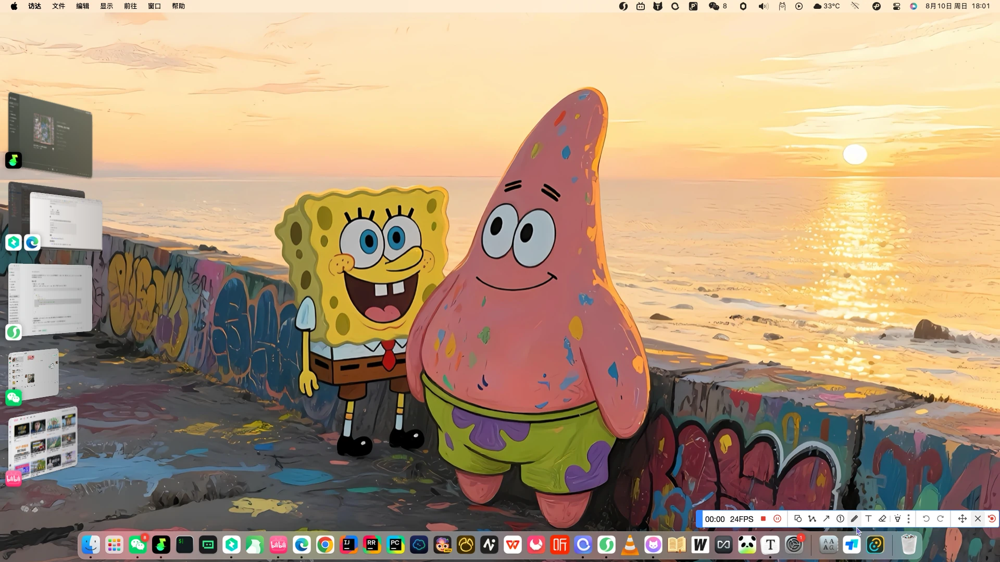

# Tauri + React + Typescript

> an awesome voice assistant


## snapshot



## Error

> 在 macOS 上调用 tauri 的内部麦克风，居然无法调用。参阅[GitHub-issue-10898](https://github.com/tauri-apps/tauri/issues/10898)
> 
> 查阅 GitHub 之后发现居然不支持调用，后续给出了一个解决方案，
>
> 就是直接通过 [Plist](./src-tauri/Info.plist) 获取 MAC 的请求，就可以调用了。
> 
> 不知道 Windows 会不会有这样的问题, 最终实现了 MacOS 捕获音频然后达到录制效果。

## Technologies

- Rust
- tauri
- React
- WebSpeech API

## Building and Running

```shell
bun tauri dev
```

## cps

```json
{
  "$schema": "../gen/schemas/desktop-schema.json",
  "identifier": "default",
  "description": "Capability for the main window",
  "windows": ["main"],
  "permissions": [
    "core:default",
    "opener:default",
    "dialog:allow-open",
    "dialog:allow-save",
    "fs:allow-write",
    "fs:allow-create",
    "fs:allow-write-file"
  ]
}
```

## libs

```shell
tauri-plugin-dialog = "2"
tauri-plugin-fs = "2"
tauri-plugin-opener = "2"
```